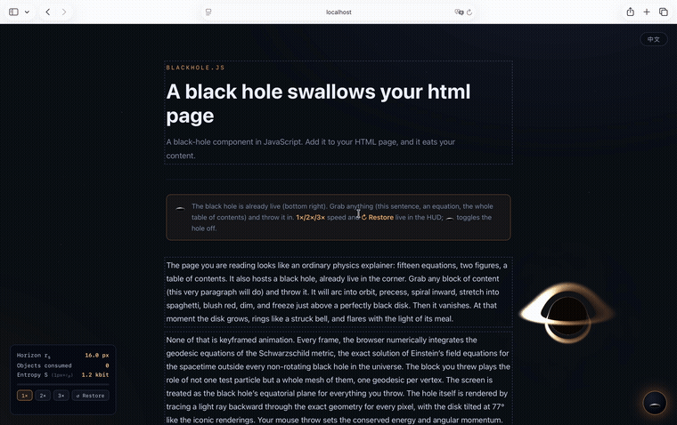

# blackhole.js

A JavaScript module that puts a physically honest black hole in the corner of your personal homepage. Turn it on, grab any block of content — a heading, a paragraph, a project card — and fling it. On release the block's interior is subdivided into a grid of independent test particles, each on its own Schwarzschild geodesic: the near edge falls faster, the block visibly warps with the curvature of spacetime, redshifts, freezes at the event horizon, and is swallowed. The hole grows with every meal, exactly as general relativity says it should: `r_s = 2GM/c²`, ring-down oscillation included.

The black hole itself is rendered by per-pixel backward ray tracing of exact Schwarzschild null geodesics in a WebGL shader (`d²x/dλ² = −3M·h²x/r⁵` in M=1 units, the Binet equation in disguise): the shadow, the photon ring, the tilted accretion disk with its lensed arcs above and below the shadow, the Doppler-boosted bright approaching side, and the gravitationally bent starfield all *emerge from the integration* — nothing is painted by hand. Every equation is documented on the page itself.



*The live page (sped up ~3.5×): grab any block — a heading, a paragraph, an equation — and throw it. Each rides its own Schwarzschild geodesic, stretches along the spacetime curvature past the tilted accretion disk, and feeds the growing horizon, its mass and entropy ticking up in the HUD.*

> The physics model and all equation implementations on this page are currently AI-generated and have not yet been verified by any human
>

## Demo

The site is plain static files, so any static server works. This repo is set up with [uv](https://docs.astral.sh/uv/) so the local preview runs on a pinned Python:

```bash
uv run python -m http.server 4173
# → http://localhost:4173
```

The first `uv run` creates `.venv/` and resolves the pinned interpreter (Python 3.14, see `.python-version`); there are no third-party dependencies — `http.server` is standard library. If you would rather not use uv, `python3 -m http.server 4173` serves the exact same files.

The black hole is live the moment the page loads; drag and throw any outlined block, or hit 🕳 (bottom right) to toggle it off.
[index.html](index.html) is a single self-contained page: a bilingual (EN/中文 toggle, English by default) guided tour of all fifteen equations — and the playground itself. Every paragraph, every heading, every rendered equation is a `data-devour` block: read the geodesic equation, then throw the geodesic equation onto a geodesic.

## Embed it in your own page

1. Copy `blackhole.js`, `blackhole.css`, and the `src/` folder next to your page.
2. Mark the elements that may be devoured with `data-devour`.
3. Initialize:

```html
<script type="module">
  import BlackHole from './blackhole.js';

  const bh = BlackHole.init({
    corner: 'bottom-right',    // 'bottom-right' | 'bottom-left' | 'top-right' | 'top-left'
    targets: '[data-devour]',  // selector for devourable blocks
    initialRs: 16,             // initial horizon radius, px
    maxRsFraction: 0.2,        // final r_s as a fraction of min(vw, vh) after eating everything
    cPx: 1600,                 // speed of light, px/s (sets the spacetime scale of your page)
    dragK: 2.0,                // radiation-reaction drag strength (0 = pure geodesics, may orbit forever)
    diskTilt: 1.35,            // accretion-disk viewing inclination, rad (0 ≈ face-on, 1.35 ≈ the classic 77° look)
    hud: true,                 // 🕳 toggle button + live HUD (mass, horizon, entropy)
  });

  // bh.activate(); bh.deactivate(); bh.destroy(); bh.state
  // bh.setTimeScale(2);  // fast-forward the whole spacetime (1×/2×/3× chips in the HUD)
  // bh.reset();          // restore every consumed element to its place, hole back to initialRs
</script>
```

The HUD also carries **1×/2×/3× time-speed chips** (impatient throwers welcome — geodesics, disk rotation and ringdown all fast-forward together) and a **↺ Restore** button that puts every consumed element back where it lived and resets the hole — the only white hole this project will ever ship.

The module injects `blackhole.css` automatically (resolved relative to `blackhole.js`), renders on a full-viewport WebGL canvas at `z-index 9998` (falling elements ride at 9999, HUD at 10000), and falls back to a 2D-canvas look if WebGL is unavailable. `Esc` or a second click on 🕳 deactivates it; anything still in flight is swallowed — this module ships no white holes.

## What is real physics and what is licensed

Exact (Schwarzschild): the timelike geodesic integrator (adaptive RK4 with per-step energy-constraint projection, drift < 1e-9), coordinate-time freezing at the horizon via `dτ = f·Δt/E`, redshift `√f`, per-pixel null-geodesic ray tracing (shadow, photon ring at `b_c = (3√3/2)·r_s`, lensed disk arcs, bent starfield), the disk g-factor `√(1−3M/r)/(1−βμ)` behind the bright/dim asymmetry, ISCO at `3r_s`, Shakura–Sunyaev `T(r)`, Keplerian `Ω(r) = √(M/r³)`, tidal warping of falling elements as emergent geodesic deviation, ringdown frequency scaling `ω ∝ 1/M`, hover acceleration `M/(r²√f)` while you hold an element.

Artistic license (honestly labeled, see the honesty box on the page): ~168-step semi-implicit Euler photon marching (the shadow edge is a couple of pixels soft), an orthographic camera and a thin fbm-textured disk instead of radiative transfer, the tilted-disk visual over in-plane page dynamics (a deliberate mixed perspective), a ×20 time magnification on the ringdown, a `(v/c)⁴` drag term inspired by 2.5PN gravitational-wave inspiral so that every throw eventually feeds the hole, snapshot limits (webfonts fall back to system fonts; external images make an element fall as a rigid body instead), and the HUD's "1 px = 1 Planck length" entropy conversion.

## Development

After editing module files, hard-refresh the page (Cmd/Ctrl+Shift+R). Simple static dev servers (`uv run python -m http.server`) let the browser heuristically cache `src/*.js`, and a half-updated module graph (fresh entry + stale internals, or vice versa) fails in silent and confusing ways. The entry pins its internal imports with a `?v=N` query (bump it when releasing) and `init()` logs a loud console warning if it detects a stale mix.

```bash
node --test tests/physics.test.mjs
# 10 physics unit tests: energy conservation (<1e-9), circular orbits,
# turning-point stability over 20 orbits, ISCO instability, horizon freeze,
# perihelion precession, geodesic deviation (tides), Newtonian limit,
# superluminal clamp, screen mapping
```

Module layout:

| File | Responsibility |
|---|---|
| `src/physics.js` | Pure-function geodesic core (no DOM) — unit system, adaptive RK4 + constraint projection, initial conditions, redshift, tides, QNM |
| `src/renderer.js` | WebGL ray-traced black hole (null geodesics, tilted disk, arcs, starfield) + falling-element mesh pass + 2D fallback |
| `src/snapshot.js` | DOM element → canvas texture (computed-style inlining + SVG foreignObject, taint-checked) |
| `src/interaction.js` | Pointer capture, drag → per-vertex test-particle mesh handoff, rigid fallback, swallow |
| `src/hud.js` | Toggle button + HUD panel |
| `blackhole.js` | Public API, mass bookkeeping, flare/ringdown state machine, main rAF loop |

## Deploy

Production is just static hosting. Copy `index.html`, `blackhole.js`, `blackhole.css`, and `src/` to any static host (GitHub Pages, Netlify, an S3 bucket) and you are done — there is no build step and no runtime, so **the deployed site does not need Python, uv, or a `.venv`.** The `pyproject.toml` / `.python-version` / `uv.lock` in this repo exist only for the local preview command above; you do not deploy them.

## Acknowledgements & third-party code

Almost all of this project is original code written for it: the geodesic integrator (`src/physics.js`), the ray-tracing WebGL shader (`src/renderer.js`), the drag/mesh/swallow interaction (`src/interaction.js`), the HUD, and the module entry. The parts that come from, or follow, other people's work are listed below.

**Inspiration**
- The idea was sparked by [s0xDk/ghostty-blackhole](https://github.com/s0xDk/ghostty-blackhole).

**Bundled third-party software**
- **[KaTeX](https://katex.org) v0.16** — MIT License, © 2013–present Khan Academy and other contributors. Loaded from the jsDelivr CDN to typeset every equation on the page. This is the only external software the project depends on.

**Public shader idioms** (reimplemented, not vendored)
- The GLSL noise helpers in `src/renderer.js` (`hash`, `vnoise`, `fbm`) are standard Shadertoy / demoscene building blocks: a sine-free integer hash in the tradition of Dave Hoskins' *"Hash without Sine"* (MIT), and value noise plus fractional Brownian motion in the formulation popularised by [Inigo Quilez](https://iquilezles.org/articles/). They were rewritten here rather than copied from any single file.

**Technique credit** (original code, borrowed method)
- `src/snapshot.js` rasterises a live DOM element to a `<canvas>` by inlining its computed styles, wrapping it in an SVG `<foreignObject>`, and drawing that as an image. This DOM-to-image trick is the one popularised by [dom-to-image](https://github.com/tsayen/dom-to-image) and [html2canvas](https://html2canvas.hertzen.com/); the implementation here is our own.

## License

MIT © 2026 0x5859. See [LICENSE](LICENSE).

